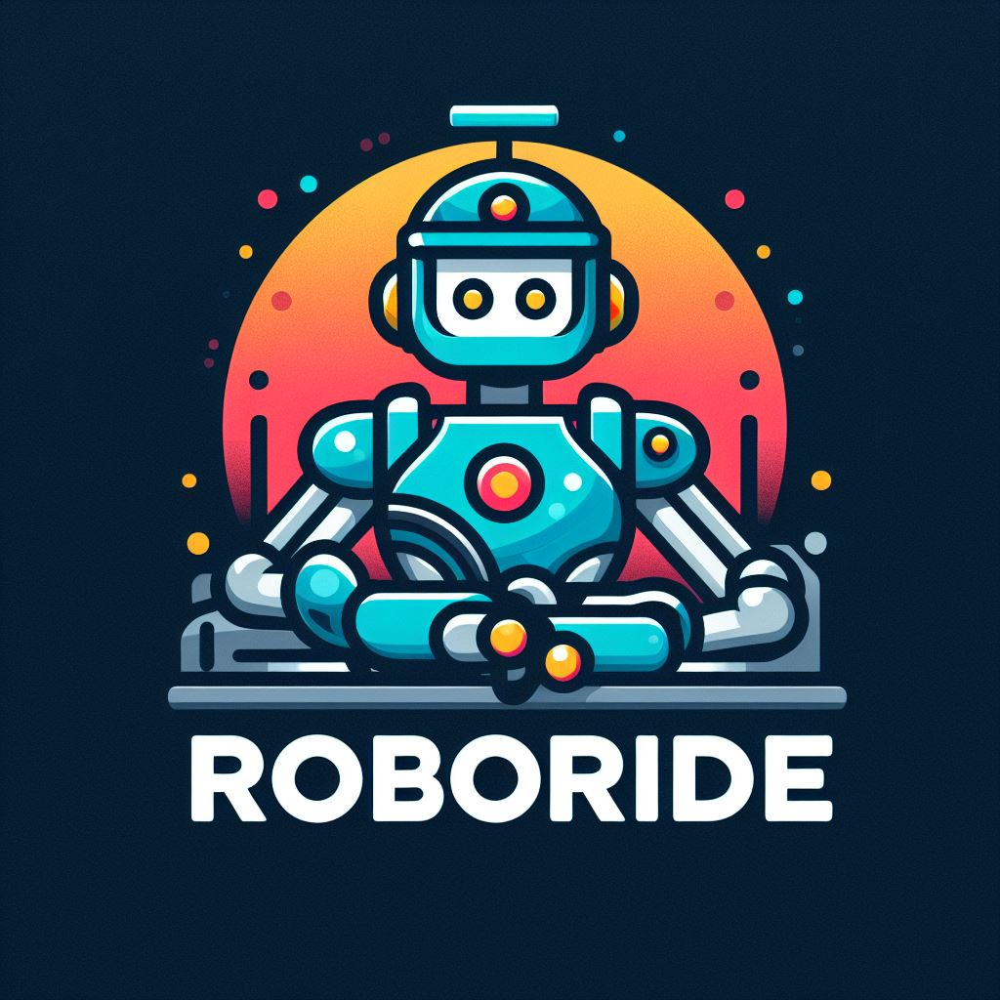

# RoboRide Rental Services | Rent-A-Car Web Application



## Overview

This repository hosts the codebase for RoboRide Rental Services, a sophisticated Rent-A-Car web application crafted as a pivotal component of the TOBETO Java-React Full-Stack Developer program. This meticulously engineered application empowers users to seamlessly peruse, explore, and lease vehicles from an extensive catalog within a virtual car rental ecosystem.

For further insights, we invite you to explore the [backend repository](https://github.com/EarthCaspian/rentACar).

## Contributors
- [Hazar Akatay](https://github.com/EarthCaspian)
- [Senem Yılmaz](https://github.com/senemyilmazz)
- [Duygu Şen Tosunoğlu](https://github.com/duygusen)
- [İnci Gülçin Durak Yolcu](https://github.com/InciGulcinDY)


## Features

### General

- User authentication and authorization
- Browse available vehicles
- Search for vehicles based on various criteria (e.g., brand, model, price, color)
- Reserve vehicles for specific dates
- View rental history
- Admin dashboard for managing vehicles, brands, and models
- Informational toast notifications to keep users informed about processes
- Listing rental history in the user profile section for easy reference
- Updating passwords conveniently within the profile section for enhanced security
- Providing the option for customers to select pick-up and drop-off locations
- Allowing customers to add additional services related to car rental, such as insurance and extra amenities
- Generating a PDF invoice at the conclusion of the rental process for customer records
- Enabling site visitors to directly contact or inquire by sending an email through the platform.


## Technologies Used

### Development Tools
- TypeScript
- HTML & CSS

### UI Frameworks/Libraries
- Bootstrap
- Boostrap React

### State Management
- Redux
- Redux Toolkit

### Form Handling and Validation
- Formik
- Yup

### HTTP Requests
- Axios

### Scripts
- npm

### Libraries
- React Datepicker
- React PDF Renderer
- React Toastify
- Routing

## Getting Started

### Prerequisites

- Node.js and npm installed globally
- Java Development Kit (JDK) installed
- PostgreSQL database installed and running

### Installation

1. Clone the repository:
   ```bash
   git clone https://github.com/EarthCaspian/project-rbride
2. Navigate to the project directory:
    ```bash
    cd rent-a-car
3. Install frontend dependencies:
    ```bash
    cd frontend
    npm install
4. Install backend dependencies (assuming Maven is installed):
    ```bash
    cd ../backend
    mvn install
5. Set up the database:
- Create a PostgreSQL database named rent_a_car
- Create application.properties with your database credentials
6. Run the backend server:
    ```bash
    cd frontend
    npm install
7. Run the frontend server:
    ```bash
    cd frontend
    npm install
8. Access the application at http://localhost:3000 in your web browser.

## Acknowledgements
We extend our sincere appreciation to [Halit Enes Kalaycı](https://github.com/halitkalayci) for his invaluable guidance throughout the [TOBETO](https://www.linkedin.com/company/tobeto/) Java-React Full-Stack Developer program, conducted under the auspices of the [İstanbul Kodluyor Project](https://www.linkedin.com/in/istanbul-kodluyor-09b981288/).


